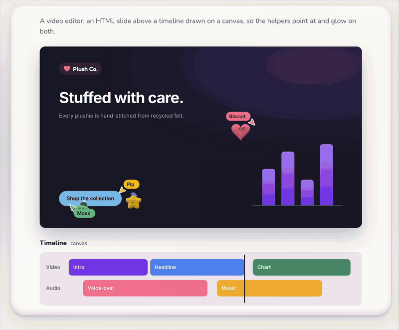

# Plushies: cute and stuffed AI helpers

Soft 3D plush characters for the web, and floating cursors that let AI helpers work *visibly* inside your app. A plushie glides to the thing it is changing, says what it is doing, shows its progress, and hops when it is done.

**[▶ Live demo and editor](https://prathje.github.io/plushies/)** · [`plushies` on npm](https://www.npmjs.com/package/plushies) · [`@plushies/cursors` on npm](https://www.npmjs.com/package/@plushies/cursors) · [MIT licensed](LICENSE)

> **Alpha / proof of concept.** This is an early, exploratory release. APIs will change, edges are rough, and nothing here is production-hardened yet. Feedback and issues are very welcome.
>
> **Built with AI agents.** This version was developed with heavy support from AI coding agents (Claude Code), from the fur shader to the e2e tests. Treat it as a PoC of what that workflow produces, not as a reference implementation.

## Demo

Three plushie helpers at work in a video editor, a design file, a website and a document. The GIF is an excerpt: **[watch the full demo video](https://github.com/user-attachments/assets/dfabee43-7ea4-497a-9c52-6a3e59263173)** (also in [`docs/plushies-demo.mp4`](docs/plushies-demo.mp4)), or play with the live version at **[prathje.github.io/plushies](https://prathje.github.io/plushies/)**.

<p align="center">
  <a href="https://github.com/user-attachments/assets/dfabee43-7ea4-497a-9c52-6a3e59263173">
    
  </a>
</p>

## What is in the box

| package | npm | |
|---|---|---|
| [`packages/plushies`](packages/plushies) | `plushies` | The characters: 17 silhouettes inflated into stuffed pillows, shell-textured fur, floating eyes, glasses, hats, squash & stretch, and a drop-in viewer for [three.js](https://threejs.org). |
| [`packages/cursors`](packages/cursors) | `@plushies/cursors` | Floating cursors for AI helpers: a plushie with its own pointer, name tag, live status box, progress and highlights. Three designs (`live`, `buddy`, `island`). |

Both are published separately. `@plushies/cursors` depends on `plushies`; use it with your own copy of three.js (or `Plushies.THREE` from the global build), or drop three.js entirely for pointer-only cursors.

## Use cases

- **Agents that work in your editor.** Show an AI helper editing a document, a design file, a spreadsheet, a timeline or a node graph. The cursor points at the element being changed, glows it, narrates the step, and the user keeps their own mouse.
- **Multi-agent dashboards.** Several helpers with distinct names and colours work at once; cursors keep their labels off each other and stay on screen when their target scrolls away.
- **Collaborative editing.** Treat agents as peers in a live document, with the same presence cursors humans get, just cuter (see [implementation ideas](#implementation-ideas) below).
- **Mascots and empty states.** Mount a single plushie as a hero, a loading state or an easter egg: it blinks, breathes, follows the pointer and hops on click.
- **Your own three.js scene.** `createPlushie` gives you a plain `THREE.Object3D` whose pose (look direction, blink, squash, lean, turn) is a set of numbers you drive every frame.

## How to use

### A plushie cursor for an AI helper

```sh
npm i @plushies/cursors plushies three
npm i -D @types/three   # TypeScript
```

```ts
import * as THREE from 'three';
import {createPlushieCursor} from '@plushies/cursors';

const editor = document.querySelector<HTMLElement>('#editor')!; // a wrapper around the editor, not a contenteditable
const headline = document.querySelector('#headline')!;

const pip = createPlushieCursor(THREE, {
  name: 'Pip',
  look: {kind: 'star', color: '#f5c518', eyes: 'happy', hat: 'cap'},
  design: 'live', // 'live' | 'buddy' | 'island'
  container: editor,
});

await pip.pointAt(headline);             // glide there and keep following it as it moves
const glow = pip.highlight(headline);    // the "working on this" mark
pip.status({text: 'Rewriting the headline', detail: 'Trying a few options', progress: 0.3, step: [1, 3]});
pip.progress(0.8);
await pip.click();
await pip.done('Headline is punchier');
glow.clear(0.8);
```

Targets can be DOM elements, boxes in container pixels, functions returning a box every frame, or shapes on a `<canvas>` via `fromCanvas`. The full API (designs, options, highlights, canvas targets, `onLost`, accessibility, performance, a no-bundler import map and a React pattern) is in the [cursors README](packages/cursors/README.md).

### A plushie on its own

```sh
npm i plushies three
npm i -D @types/three   # TypeScript
```

Plain JS in an HTML page; the import map makes the bare specifiers work without a bundler (with one, drop it):

```html
<script type="importmap">
  {"imports": {
    "three": "https://cdn.jsdelivr.net/npm/three@0.186.0/build/three.module.js",
    "plushies": "https://cdn.jsdelivr.net/npm/plushies@0.1.0-alpha.1/dist/index.js",
    "plushies/viewer": "https://cdn.jsdelivr.net/npm/plushies@0.1.0-alpha.1/dist/viewer.js"
  }}
</script>
<div id="hero" style="width: 360px; height: 360px"></div>
<script type="module">
  import * as THREE from 'three';
  import {mountPlushie} from 'plushies/viewer';

  const view = mountPlushie(document.querySelector('#hero'), THREE, {
    kind: 'heart',
    color: '#f47c9a',
    mouth: 'smile',
    glasses: 'round',
    idle: true,          // blink, breathe, glance around
    followPointer: true, // eyes follow the mouse
  });
  view.canvas.addEventListener('click', () => view.hop());
</script>
```

No bundler and no three of your own? One script tag, three bundled in, everything on `window.Plushies`:

```html
<script src="https://cdn.jsdelivr.net/npm/plushies@0.1.0-alpha.1/dist/plushies.global.js"></script>
<script>
  Plushies.mountPlushie(document.getElementById('hero'), {kind: 'heart', idle: true});
</script>
```

Every look option (kinds, fabrics, eyes, hats, pins, colours), the per-frame pose, the CDN routes (including `plushies/bundled` as a single module URL), the sizes and the three.js integration are in the [plushies README](packages/plushies/README.md). The [workbench on the site](https://prathje.github.io/plushies/) lets you configure a plushie and copy the code.

### React, Next.js and SSR

Importing either package anywhere is fine (nothing touches the DOM until you call it), but `mountPlushie`, `createPlushie` and `createPlushieCursor` need a browser and throw a named error without one. In React, call them in an effect after the element exists and `dispose()` in the effect's cleanup; StrictMode's mount, dispose, mount is safe. Apply prop changes with `view.restyle()` / `cursor.setLook()` / `cursor.setDesign()` instead of remounting, and keep one cursor per agent id. In the Next.js App Router a `'use client'` component is all it takes: no `next/dynamic`, and server components can import the packages for their constants and types. Snippets in the [plushies](packages/plushies/README.md#react-and-ssr) and [cursors](packages/cursors/README.md#react) READMEs.

### Develop

```sh
bun install          # once, here at the root
bun run typecheck    # both packages
bun run test         # unit tests of both
bun run build        # dist/ of both
bun run site:build   # the GitHub Pages site: the cursor demo and the plushie workbench, one page
bun run test:e2e     # browser tests of both (Playwright; build and site:build first)
bun run vendor       # refresh the engine's vendored copy: ../engine/assets/vendor/plushies.js
```

The site is one page in `packages/plushies/site`: the cursor demo (three helpers in six kinds of app, with a design switch and one helper that follows you), then the gallery, the workbench and the docs. While developing, run `bun run site:dev` in `packages/plushies` and open <http://localhost:4517>.

## Implementation ideas

The cursors are deliberately dumb: they only know *where to point* and *what to say*. Wiring them to a real agent is up to your app. Some shapes that fit well:

- **Tiptap + Hocuspocus (Yjs).** In a [Tiptap](https://tiptap.dev) editor synced through [Hocuspocus](https://tiptap.dev/docs/hocuspocus), an agent joins the document as one more Yjs peer: it writes its edits into the shared `Y.Doc` and publishes its presence through awareness, like a human collaborator, with a few extra fields: `{user: {name, color, agent: true}, cursor: {anchor, head}, plushie: {status, detail, progress, done}}`, where `anchor`/`head` are Yjs relative positions as JSON (`Y.relativePositionToJSON(Y.createRelativePositionFromTypeIndex(ytext, i))` works from a headless Node agent with no ProseMirror at all). On the client, resolve them to absolute positions with `relativePositionToAbsolutePosition` and the sync plugin's binding (`ySyncPluginKey.getState(editor.state).binding.mapping`; from `@tiptap/y-tiptap` in Tiptap v3, `y-prosemirror` in v2; the binding is empty until the first render, so keep the last box until then). Point the cursor at a `VirtualElement` whose `getBoundingClientRect()` recomputes `view.coordsAtPos(pos, -1)` for anchor and head every frame: those are viewport pixels, which is what a virtual element returns, and re-reading them follows typing, scrolling and layout. Pass a wrapper *around* the editor as `container`, never `editor.view.dom` (ProseMirror removes foreign nodes from its contenteditable). Hide the default caret for the agent in `@tiptap/extension-collaboration-caret` (the v3 name of `collaboration-cursor`) by branching on `user.agent` in `render` and returning a *visible* zero-width span, not `display: none`, which makes `coordsAtPos` return zeros. Awareness re-sends the whole state, so dedupe: call `status()` only when text, detail or progress changed and `done()` once per new `done` message; dispose the cursor when the agent's state is gone. All of this is about forty lines of glue around `awareness.on('change', …)`.
- **A plain WebSocket channel.** For apps without CRDT state, stream agent events from your backend. The package has no schema; a minimal vocabulary that covers everything a cursor can show is `{type: 'start' | 'status' | 'progress' | 'done' | 'leave', agent, target, text, detail, progress, step}` with `target` a stable selector or `data-id` for DOM elements, or a canvas box with its coordinate space for `fromCanvas`. Lifecycle: create the cursor on an agent's first event, `dispose()` it on `leave`, let the same name on a reconnect reuse its cursor rather than make a second one, and clear your highlights when the socket drops (the handle belongs to your app; a highlight outlives the task until you `clear` it). A missing target gives `pointAt(null)` → `'lost'`; decide what the user sees then. The exact call sequence for one task is `work()` in [`packages/plushies/site/helpers.ts`](packages/plushies/site/helpers.ts): `pointAt` → `highlight` → `status({text, detail, progress, step})` per step with a few `progress()` ticks → optional `click()` → apply the change → `await done(text)` → `glow.clear(0.8)`. The scenes in `packages/plushies/site/scenes/` are the targets and texts it runs, not the protocol.
- **Tool-call hooks.** If your agent runs through a tool-use loop (edit a cell, rename a layer, move a clip), emit a cursor event before and after each tool call: point and glow before, `done` after. That gives a faithful, low-effort trace of what the model actually touched.

## License

[MIT](LICENSE) © 2026 Patrick Rathje. Use it in anything, commercial or not, and keep the notice.
